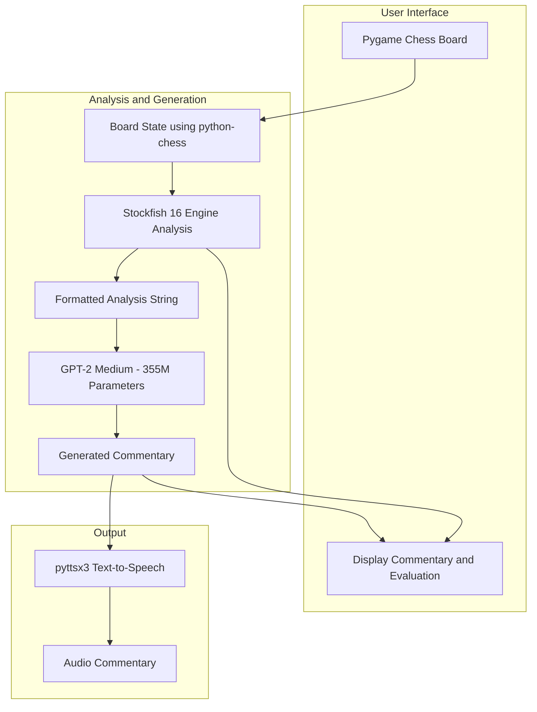

# ♟️ AI Commentator for Chess

<p align="center">
  
  
  
</p>

---

## 🎯 Project Overview

**AI Commentator** is an intelligent, offline-compatible chess analysis system that generates real-time, human-like commentary for chess moves. It integrates the Stockfish 16 chess engine, a feature extraction pipeline, and a fine-tuned GPT-2 transformer model to provide insightful and educational move analysis. Commentary is delivered both as on-screen text and via speech using `pyttsx3`.

---

## 📽️ Demo Video
(click here to view 👉)
[](https://www.youtube.com/watch?v=VDpL0ZqGGKA)

---

## 🖼️ Key Visuals

<table>
<tr>
<td align="center"><strong>System Architecture</strong><br></td>
<td align="center"><strong>Model Loss Curve</strong><br></td>
</tr>
<tr>
<td align="center"><strong>GUI Interface with Commentary</strong><br></td>
</tr>
</table>

---

## 🔍 Problem Statement

While expert chess engines provide high-quality evaluations, they lack the clarity and accessibility required by beginners or casual users. Most tools also require online access. This system addresses that gap by providing:

- 🧠 Natural language explanations for every move  
- 🔌 Offline functionality for resource-constrained environments  
- 📚 An immersive and educational gameplay experience  

---

## 🚀 Features

- 🧠 Real-time move evaluation using **Stockfish 16**
- 🗣️ Natural language commentary using **fine-tuned GPT-2**
- 🔊 Offline **Text-to-Speech** via `pyttsx3`
- 📦 Fully **modular & offline-compatible** (no internet needed)
- 🎮 Interactive GUI built with **Pygame**

---

## 🔧 Tech Stack

| Component                  | Tool/Library                        |
|---------------------------|-------------------------------------|
| Chess Engine              | [Stockfish 16](https://stockfishchess.org) |
| GUI & Game Logic          | `pygame`, `python-chess`            |
| NLP Model                 | [GPT-2](https://openaipublic.blob.core.windows.net/gpt-2/models) |
| Feature Extraction        | Custom pipeline on FEN strings      |
| TTS (Speech)              | `pyttsx3` (offline)                 |
| Data Source               | [Lichess.org](https://lichess.org/) |

---

## 📐 System Architecture


## 📦 How to Run the Project

### 🗂️ Download Instructions

To get started quickly:

👉 **Download only the `game_folder/`** from the repository:  
🔗 [github.com/jayanth9844/Ai-Commentator](https://github.com/jayanth9844/Ai-Commentator)

### 🚀 Run the Application

Once you've downloaded the folder:

```bash
# Step into the game folder
cd game_folder

# Run the interface
python interface_buil.py
```
